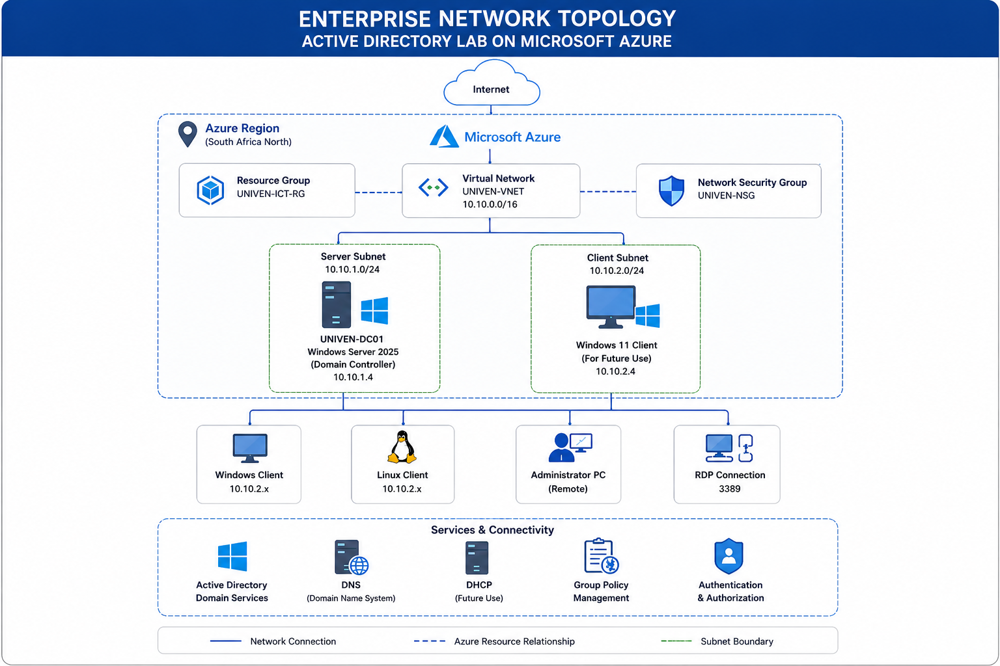

  

<h1 align="center">
Enterprise Active Directory Domain Services (AD DS) Lab on Microsoft Azure
</h1>

A real-world enterprise infrastructure deployment using Microsoft Azure, Windows Server 2025, Active Directory Domain Services, DNS, Azure Virtual Networking, and Identity Management.

---

## 🌐 Live Project Website

> **GitHub Pages**

**https://YOUR-USERNAME.github.io/Enterprise-Active-Directory-Azure-Lab/**

---

## 📖 Project Overview

This project demonstrates the complete deployment of an enterprise Windows infrastructure hosted on Microsoft Azure. It simulates a real corporate environment where Active Directory Domain Services (AD DS) provides centralized authentication, identity management, DNS, and organizational administration.

The deployment was completed entirely from scratch, documenting each stage of the implementation, troubleshooting challenges, and final infrastructure architecture.

---

## 🚀 Project Highlights

- ✅ Microsoft Azure Infrastructure Deployment
- ✅ Windows Server 2025 Deployment
- ✅ Active Directory Domain Services (AD DS)
- ✅ Domain Controller Promotion
- ✅ DNS Configuration
- ✅ Azure Virtual Networking
- ✅ Organizational Unit (OU) Design
- ✅ Security Group Administration
- ✅ Domain User Management
- ✅ Enterprise Documentation
- ✅ Real Deployment Screenshots
- ✅ Architecture Diagrams
- ✅ Troubleshooting & Resolution Documentation

---
